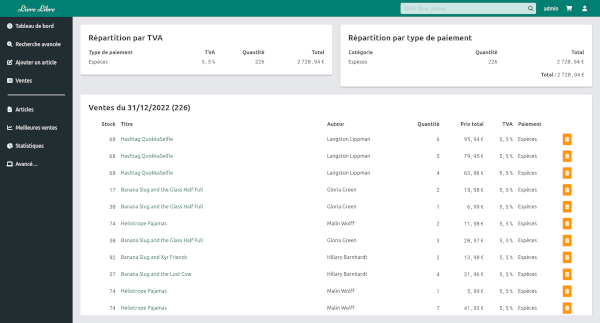

# Livre Libre

Livre Libre est un logiciel libre de gestion de librairie.
Il permet de gérer les stocks, les ventes, les commandes, et fournit des statistiques sur les ventes.



## Démo

Une [démo en ligne](https://livrelibre.vercel.app) est accessible.

Pour se connecter, utiliser les identifiants `admin/admin`

## Prérequis

Livre Libre nécessite [Node.js](https://nodejs.org) et [MongoDB](https://www.mongodb.com/) pour fonctionner.

## Installation

```
git clone https://github.com/poissoj/livrelibre.git
cd livrelibre
pnpm install
```

## Configuration

Générez un mot de passe pour COOKIE_PASSWORD.
Créez le fichier `.env.local` avec les infos suivantes:

```
MONGODB_URI=mongodb://localhost:27017/tsavant
COOKIE_PASSWORD=pN2MLv2tEvY4wDeH3fKWh9Hwm1piff2T3m
```

## Build

```
npm run build
```

## Lancement

Lancez la commande `npm start` pour lancer l'application. Par défaut, elle est accessible par navigateur sur http://localhost:3000.
