# Guide utilisateur

Ce guide détaille les différents parcours dans Livre Libre : recherche d'articles,
caisse, gestion des client⋅es et des commandes, consultation des ventes,
statistiques, import/export. Pour une présentation générale, voir le
[README](../README.md).

## Se connecter

Depuis la page **Connexion** (`/login`) :

1. Saisir l'`Identifiant` et le `Mot de passe` (bouton `Afficher` / `Masquer`).
2. Cliquer sur `Connexion`.

En cas d'échec, un message d'erreur s'affiche (par exemple « Identifiants
invalides. »). La session est valable **7 jours** ; passé ce délai, la connexion
est requise à nouveau.

Pour se **déconnecter**, cliquer sur l'icône utilisateur en haut à droite
(`Se déconnecter`).

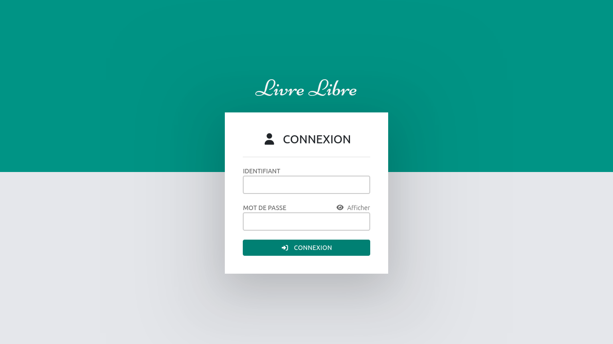

## L'interface

**Barre latérale** (navigation principale) :

- `Tableau de bord` (`/`)
- `Recherche avancée` (`/search`)
- `Ajouter un article` (`/add`)
- `Ventes` — pointe vers `/sales` pour un administrateur, `/todaySales` pour un⋅e caissier⋅ère
- `Commandes` (`/orders`)
- `Client⋅es` (`/customers`)
- `Articles` (`/items`)
- `Meilleures ventes` (`/best-sales`)
- `Statistiques` (`/stats`)
- `Avancé…` (`/advanced`)

**En-tête** :

- `Rechercher` — recherche rapide (`ISBN, titre, auteur·ice`) ; un ISBN (10 chiffres
  ou plus) ouvre directement la fiche de l'article, sinon une recherche texte.
- Icône panier (`Voir le panier`) avec un badge indiquant le nombre d'articles.
- Nom de l'utilisateur et bouton `Se déconnecter`.

## Tableau de bord

La page d'accueil (`/`) présente :

- `Favoris` — la liste de vos articles mis en favori, avec un bouton d'ajout
  direct au panier. Le titre d'un article ouvre sa fiche.
- `Vendre un article non répertorié` — pour encaisser un article absent du
  catalogue : renseigner `Prix`, `Titre`, `Type` et `TVA`, puis `Ajouter au panier`.

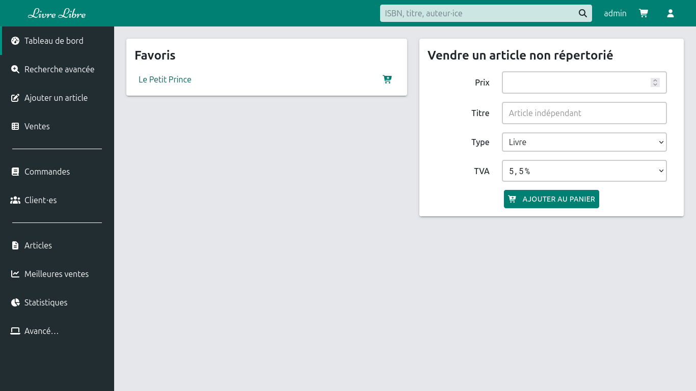

## Rechercher un article

Trois points d'entrée :

- **Recherche rapide** (en-tête) — taper un `ISBN, titre, auteur·ice`. Utiliser
  `/quicksearch` pour les résultats paginés.
- **Recherche avancée** (`/search`) — formulaire détaillé : `Type`, `ISBN`,
  `Auteur·ice`, `Titre`, `Maison d'édition`, `Distributeur`, `Mots-clés`,
  `Date d'achat`, `Commentaires`, `Prix de vente`, `Quantité`, `TVA`. Le bouton
  `Rechercher` affiche les résultats sur `/advancedSearch` ; la case `En stock`
  filtre les articles disponibles.
- **Articles** (`/items`) — liste complète, avec un bouton d'ajout au panier par
  ligne.

Depuis n'importe quelle liste, l'icône d'ajout au panier ajoute l'article, et le
titre ouvre la fiche (`/item/:id`).

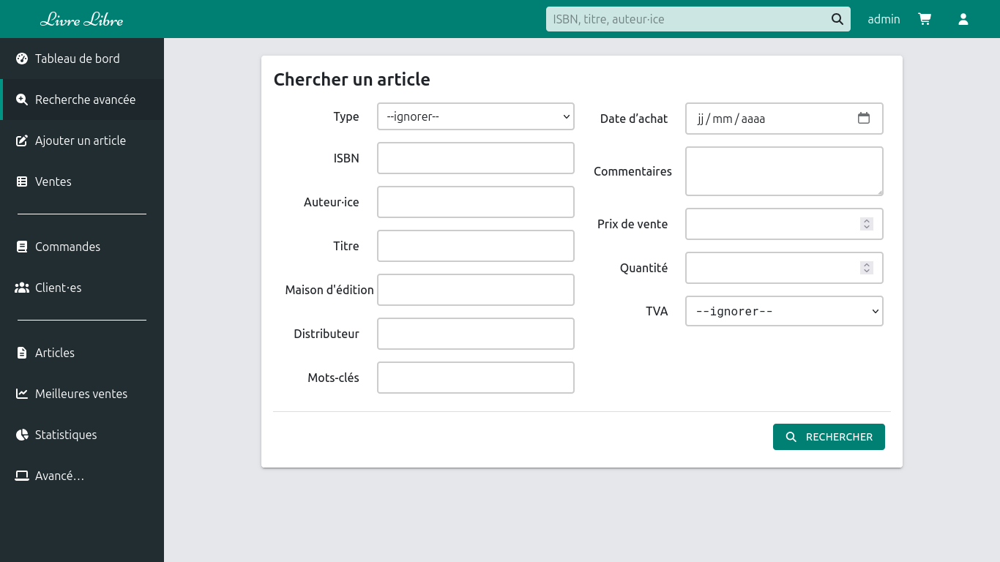

## Ajouter / modifier un article

**Ajouter** (`/add`) via le formulaire `Ajouter un article` :

1. Choisir le `Type` (voir l'annexe).
2. Facultatif : saisir un `ISBN` puis cliquer sur la loupe
   (`Chercher les infos pour cet ISBN`) ou appuyer sur Entrée pour remplir
   automatiquement `Titre`, `Auteur·ice` et `Maison d'édition`.
3. Compléter les champs ; `Titre` et `Prix de vente` sont requis.
4. Cliquer sur `Ajouter`.

**Modifier** (`/update/:itemId`) : même formulaire, boutons `Retour` et
`Modifier`. La fiche article (`/item/:id`) permet aussi :

- `Commander` — créer une commande liée à l'article.
- l'icône favori — ajouter/retirer des favoris (`Ajouter aux favoris` /
  `Enlever des favoris`).
- régler la `Quantité` puis `Ajouter au panier`.
- consulter `Ventes des 2 dernières années`.

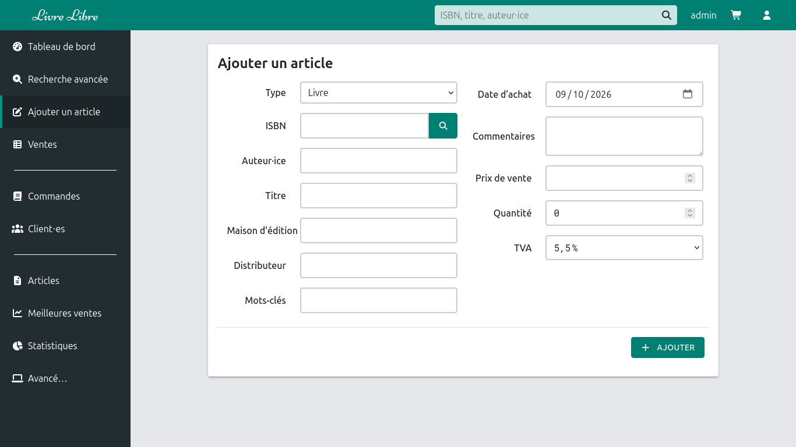

## La caisse (panier)

Le panier (`/cart`) regroupe les articles d'une vente.

1. **Ajouter des articles** :
   - `Ajout rapide :` — saisir un `ISBN` et valider (adapté au lecteur de
     code-barres). Messages possibles : « Aucun article trouvé pour <isbn> »,
     « Pas de stock pour <titre> ».
   - depuis une recherche, la liste d'articles, les favoris ou la fiche article.
2. **Associer un⋅e client⋅e** — via `Associer un⋅e client⋅e…` pour la vente en
   cours.
3. **Remise de fidélité** — si un⋅e client⋅e est associé⋅e, une `Remise possible`
   peut être appliquée (`Appliquer`) ; elle ajoute une ligne
   `Remise carte de fidélité` (3 %).
4. **Mettre de côté** — `Mettre de côté` suspend le panier courant (un seul
   panier en attente à la fois). Le bouton `Réactiver` de la carte
   `Panier en attente` le reprend.
5. **Payer** — renseigner la `Date` et le `Type` de paiement, puis cliquer sur
   `Payer`. Types disponibles : `Espèces`, `Carte bleue`, `Chèque`,
   `Chèque lire`, `Virement`.

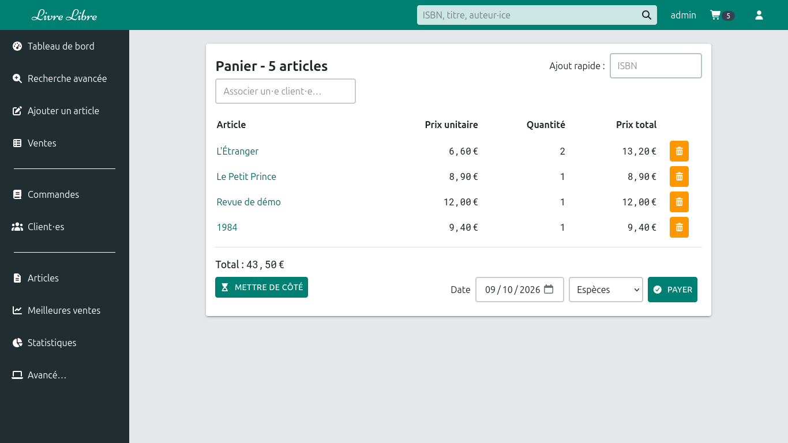

## Gérer les client⋅es

- **Liste** (`/customers`) — recherche par `Nom, prénom`, case `Avec achats`,
  bouton `Nouveau client`. Colonnes : `Nom`, `Téléphone`, `Mail`,
  `Remarque contact`, `Commentaire`, `Remise`, `Total`.
- **Créer** (`/customer/new`) — renseigner `Nom complet` (requis), `Téléphone`,
  `Email`, `Remarque contact`, `Commentaires`, puis `Ajouter`. Un nom déjà
  existant est refusé.
- **Créer depuis une commande** — bouton `Nouveau client` dans le formulaire de
  commande.
- **Fiche client⋅e** (`/customer/:id`) — `Modifier un⋅e client⋅e`, `Détail des
  achats` (date et montant), `Commandes en cours`. Suppression possible via le
  dialogue de confirmation, sauf si le⋅la client⋅e a des commandes.

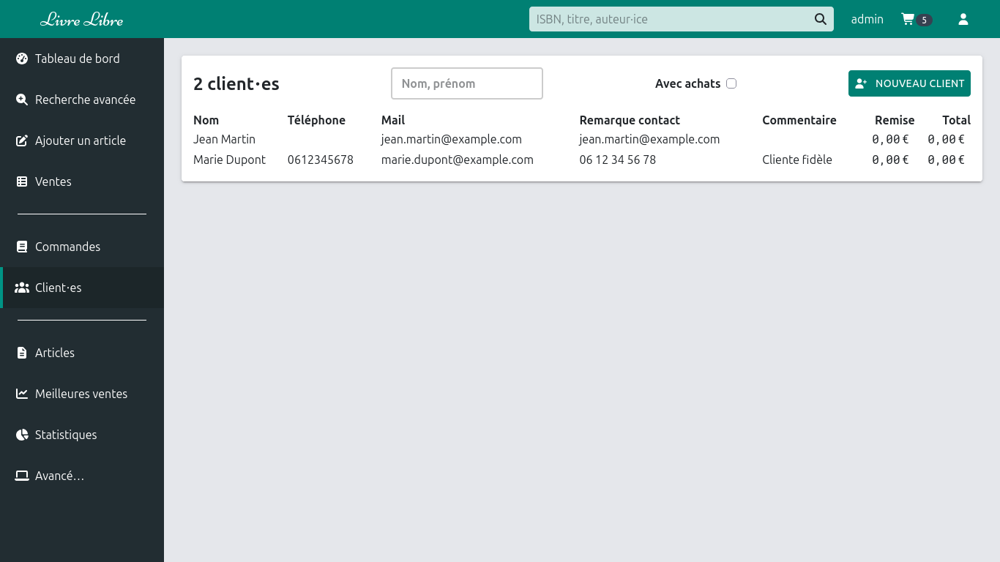

## Gérer les commandes

**Créer une commande** (`/order/new`, ou `Commander` depuis un article, ou
`Nouvelle commande` depuis la liste) :

1. Choisir le `Client⋅e` (ou créer un⋅e nouveau⋅elle client⋅e).
2. `Contacter par` : `Non renseigné`, `Passera`, `Téléphone` ou `Mail`.
3. Renseigner la `Date`.
4. Saisir un `ISBN` (facultatif) et/ou choisir le `Titre`
   (`Article non répertorié` possible).
5. Compléter `Commentaires`, `Nb d'exemplaires`, `État`, ainsi que les cases
   `Payé` et `Client⋅e informé⋅e`.
6. Cliquer sur `Ajouter`.

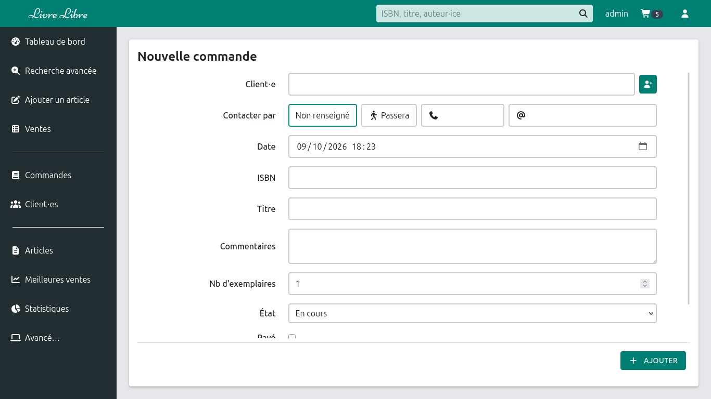

**Suivre les commandes** (`/orders`) :

- Filtres d'`État`, recherche (`Nom, prénom, titre, ISBN`) et option
  `Grouper les commandes par client⋅e`.
- Colonne `Prévenu⋅e` pour cocher l'information du⋅de la client⋅e.
- Ouvrir une commande (`/order/:orderId`) pour la `Modifier` ou la supprimer.

**États d'une commande** : `En cours`, `Reçu`, `Indisponible`, `Annulé`,
`Terminée`, `Autre`.

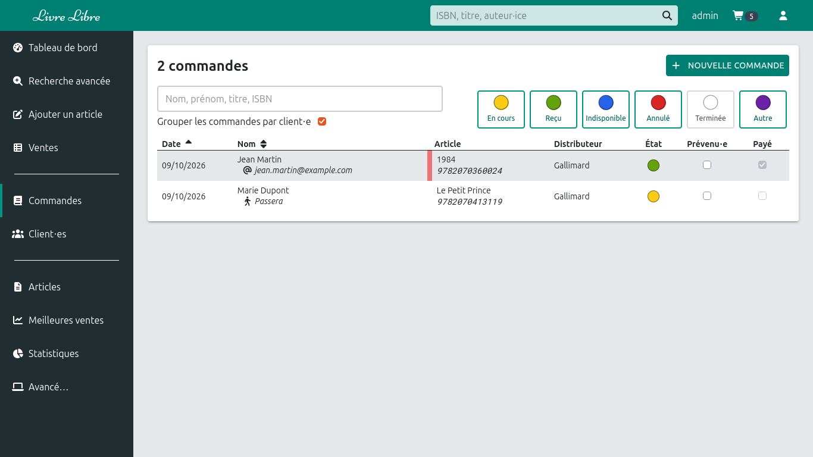

## Consulter les ventes

- **Administrateur** : `Ventes` (`/sales`) liste les ventes par mois. Cliquer sur
  un mois (`/sale/:year/:month`) puis sur un jour (`/sale/:year/:month/:day`) pour
  le détail. Chaque écran affiche des répartitions par TVA (et par catégorie ou
  type de paiement selon le niveau).
- **Caissier⋅ère** : `Ventes` mène directement aux `Ventes du jour`
  (`/todaySales`).

Dans le détail d'un jour, la table indique Stock, Titre, Auteur·ice, Quantité,
Prix total, Panier, TVA, Paiement, ainsi qu'un bouton `Supprimer` pour annuler une
vente. Un⋅e caissier⋅ère ne peut supprimer qu'une vente du jour ; la suppression
d'une vente passée est réservée aux administrateurs.

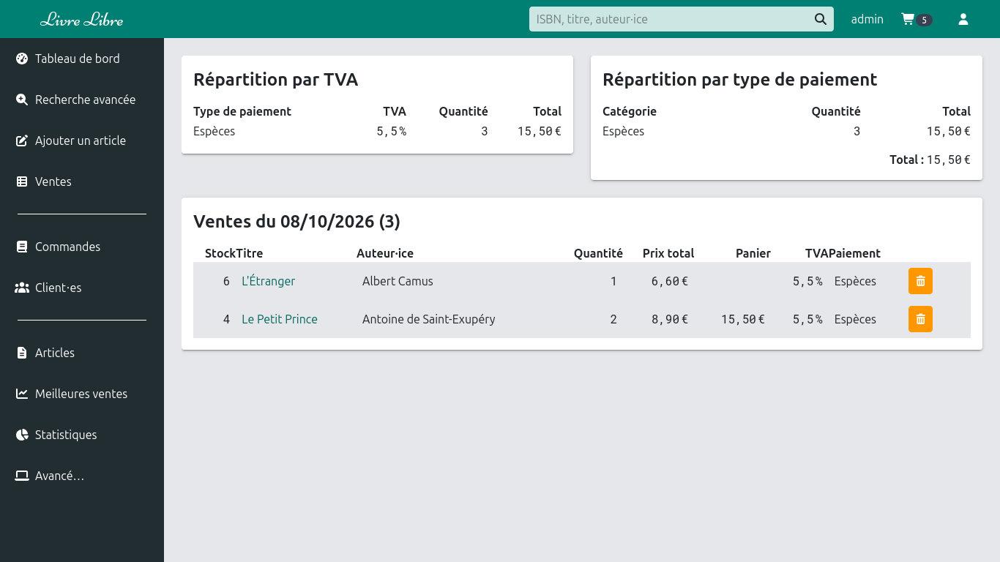

## Statistiques et meilleures ventes

- **Statistiques** (`/stats`) — graphiques `Nombre de ventes par heure` et
  `Nombre de ventes par jour`.
- **Meilleures ventes** (`/best-sales`) — classement (`#`, `Titre`, `Auteur·ice`,
  `Vendus`, `En stock`).

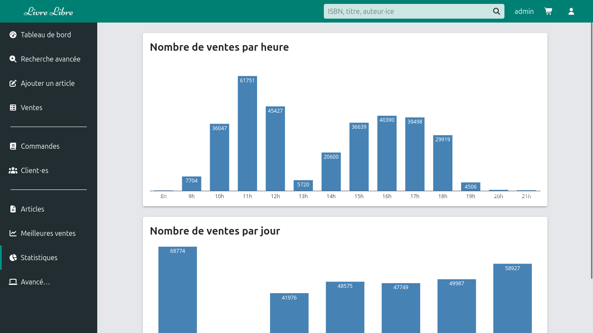

## Avancé : import / export

Page `Avancé…` (`/advanced`) :

- **Importer un fichier DILICOM** — sélectionner un fichier `.csv`, `.slk` ou
  `.xlsx` puis `Envoyer`. Un aperçu s'affiche ; cliquer sur `Valider` pour
  confirmer ou `Annuler`. Un message indique le nombre d'articles importés.
- **Export du stock** — bouton `Télécharger` pour obtenir le stock au format CSV.

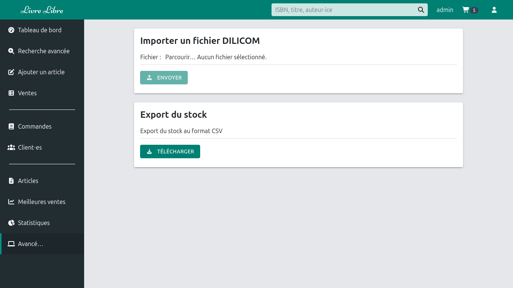

## Rôles et permissions

| Fonction                                                                   | `admin`     | `cashier`                      |
| -------------------------------------------------------------------------- | ----------- | ------------------------------ |
| Ensemble des écrans (articles, client⋅es, commandes, stats, import/export) | Oui         | Oui                            |
| Ventes par mois (`/sales`)                                                 | Oui         | Non                            |
| Ventes du jour (`/todaySales`)                                             | Oui         | Oui                            |
| Consulter une vente passée                                                 | Oui         | Non (jour en cours uniquement) |
| Supprimer une vente                                                        | Toute vente | Jour en cours uniquement       |

Les écrans réservés affichent « Vous n'êtes pas autorisé à accéder à cette
partie. » en cas d'accès non permis.

## Annexe — tables de référence

**Types d'articles** : Livre (par défaut), Carte postale, Papeterie, Jeu, Revue,
DVD, Consigne, Inconnu.

**Taux de TVA** : `20`, `5.5` (par défaut), `2.1`, `0`.

**Types de paiement** : `Espèces`, `Carte bleue`, `Chèque`, `Chèque lire`,
`Virement`.
